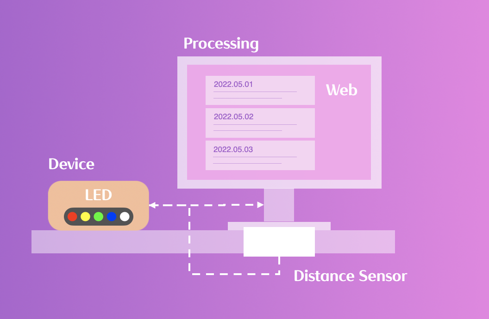
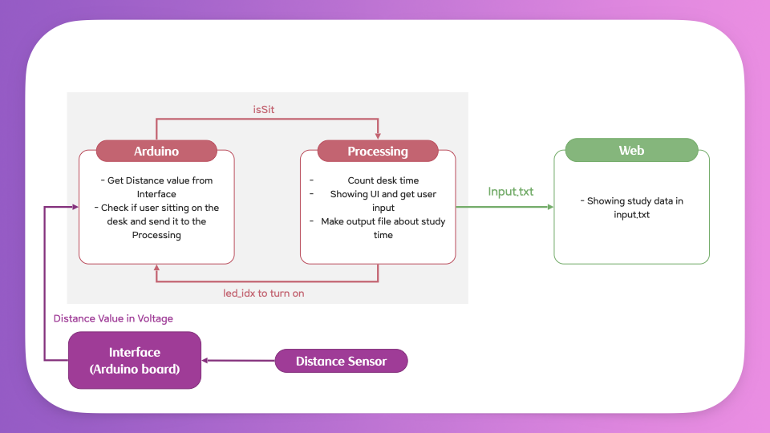
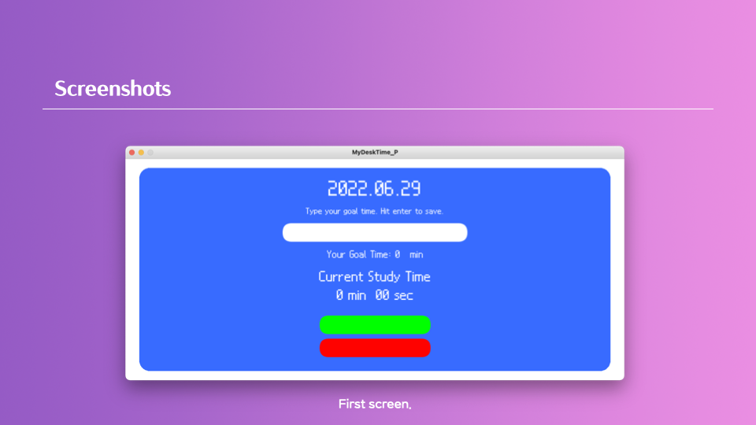
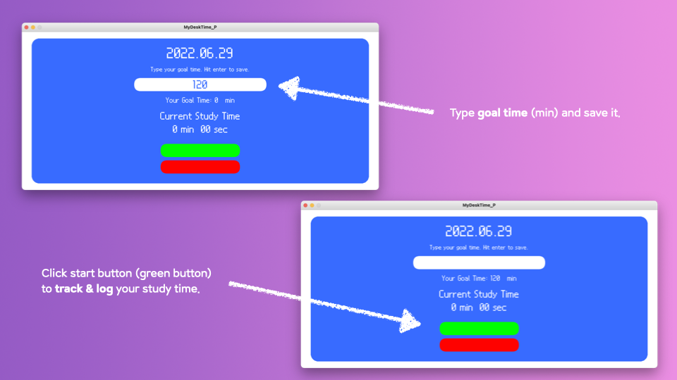
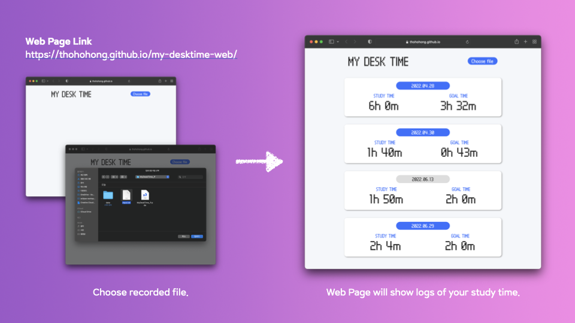

# MyDeskTime
2022 Spring Semester AAT3003 Digital Fabrication Final Project 'My Desk Time'

# Theme
### Well Begun is Half Done.
Getting out of bed and sitting at a desk takes a lot of determination.
Keeping your time on log also requires more effort than we think.

Our project, “MyDeskTime” will help you track & log your study time automatically.

# Function
### SET GOAL TIME
- User can type goal time as one likes and save it.

### TRACK & LOG STUDY TIME
- If user is in front of the desk, “MyDeskTime” will record the current study time. 
- If user is not in front of the desk, the current study time will not be recorded.

### INFORM THE STATUS WITH DEVICE
- As the current study time goes by, the LED of the device will turn on.

### WEB PAGE
- After studying, user can check the records through web page.

# System Structure

# Screenshots

# Demo Video
